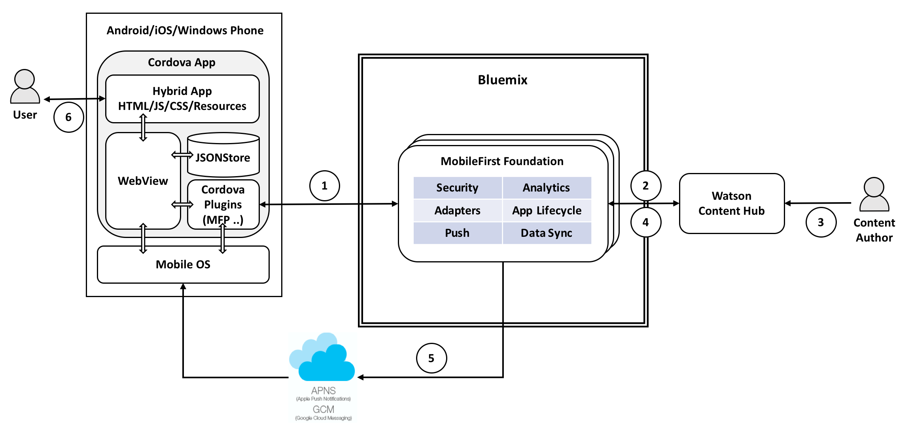

**Note**: This is a work in progress.

# MobileFoundation-Ionic-WatsonContentHub

1. When the user launches the mobile app, a call is made to MobileFirst adapter to fetch the app content.
2. MobileFirst adapter fetches the content from Watson Content Hub and returns it to the mobile app for displaying to user.
3. Content author logs in to Watson Content Hub and creates a new content or updates an existing one.
4. The MobileFirst adapter which keeps polling Watson Content Hub for changes, notices the content change.
5. The MobileFirst adapter which noticed the content change, sends a Push notification to the mobile app with the ID of the new/updated content.
6. Users see a push notification in the notification bar informing them of the new/updated content. If user clicks on the push notification, the mobile app is launched and the new/updated content is fetched from Watson Content Hub and shown to the user.
